最近真的是各种奇葩需求各种提，单位恨不得每个产品都要单独搞一个App来支持，So每次打包提测都是超级痛苦，一次n多个包每个包又有两三个环境，每次搞得头都大了，于是研究了下持续集成，Jenkins这个最近很火的持续集成和持续交付工具当然是首选了。
## 安装
对于安装我就不多说了，网上一搜一大堆，官方教程也很详细，直接去看就好了[Jenkins安装](https://jenkins.io/doc/pipeline/tour/getting-started/)
### 新建工程
这个其实很多文章也都写的很详细了，登录后选择“新建”， 输入项目名称，选择“构建一个自由风格的软件项目”， 点击ok就好了
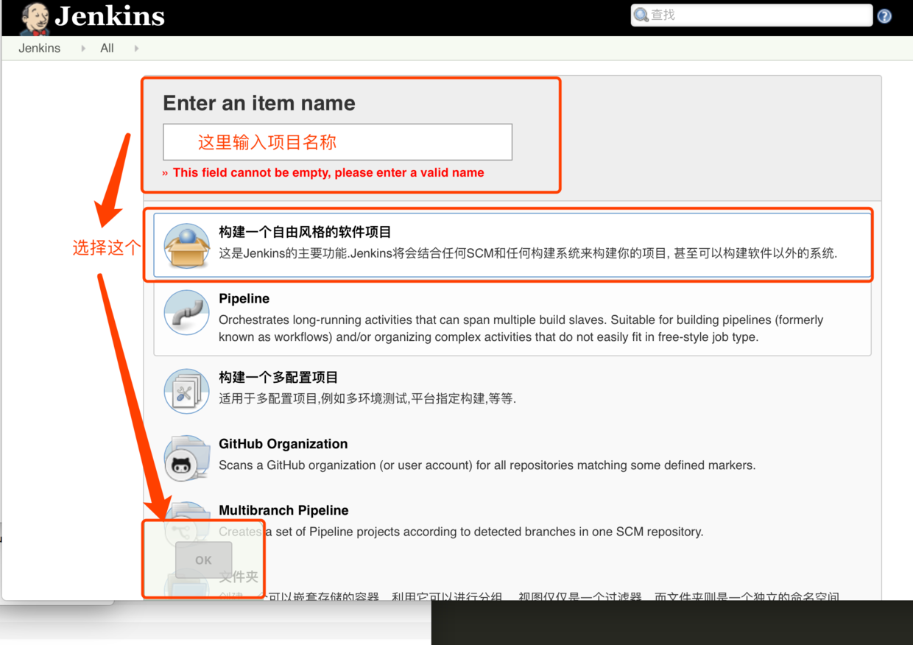

新建完之后界面大概就是这样的

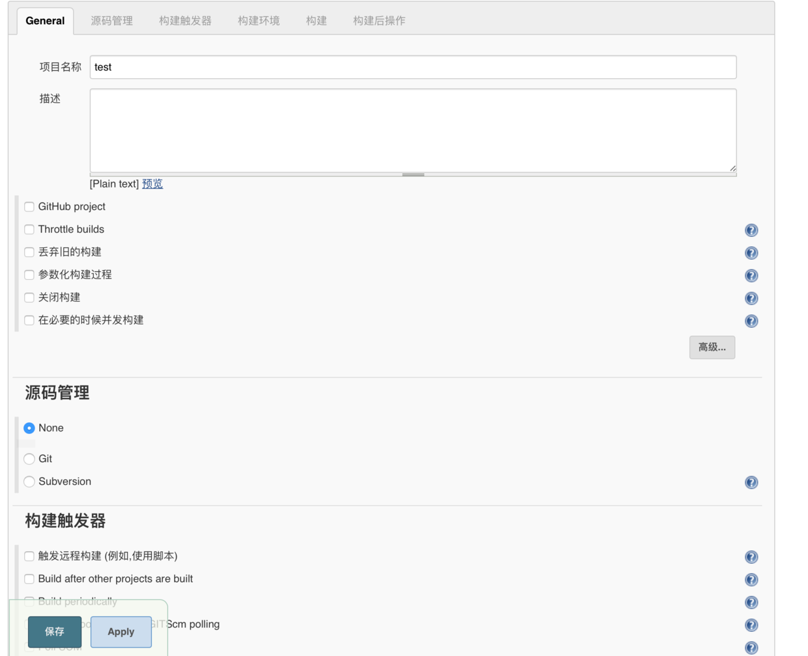

### General
这里可以设置一些项目基本信息，构建后的项目保存的时间等等，这里就不过多介绍了，不是必填项，怎么感觉到现在为止还啥都写，一路略过来😂。。

### 源码管理
这里可以设置None， Git， Svn

None就不说了，没有源码管理，不必从网上check
Git：
输入Url， Credentials， Branches就好了
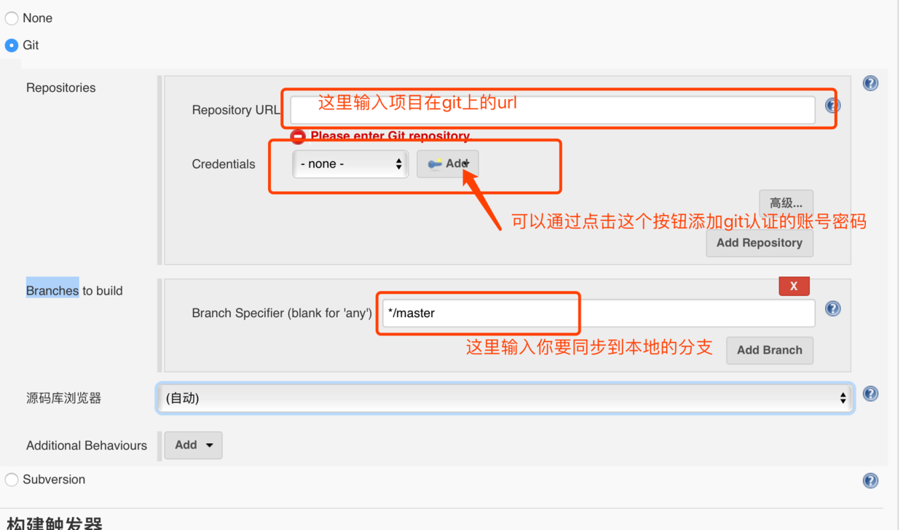

SVN：
跟git差不多
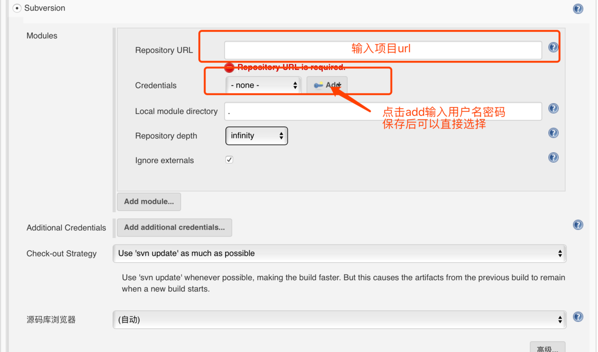


### 构建触发
这里可以通过一些方法自动触发构建操作，而不需要通过登录到jenkins手动触发构建，同样不多介绍

### 构建环境
由于我在后边构建中使用的是shell，没有使用jenkins提供的插件，所以这一步没过多研究
不过我发现在这里有些blog上使用插件构建的时候在选择“Keychains and Code Signing Identities”以及“Mobile Provisioning Profiles”这两个地方的描述有些不负责任。
在升级到Sierra之后是无法获取到`login.keychain`的，`/Users/murphlu/Library/Keychains`目录下找到的只有`.keychain-db`文件，这个文件jenkins的插件是识别不到的(我找了好多人写的所谓的解决方法，并没有成功解决这个问题，如果有谁有亲测可行的方法也希望能指正)，这也是为啥我选择了使用xcodebuild在shell中直接写，而不是用jenkins的插件“Xcode integration”去实现自动打包。
使用xcodebuild通过shell实现自动打包也是有好处的，可控性要高一些，我们可以知道我们每一步都在做什么。这一步同样略过。

### 构建

敲黑板， 重点来了~~

首先，如果是pod项目，可以通过添加 Update CocoaPods 确保在打包之前我们的 pod 是正常状态，当然如果每次都执行pod update过慢的话可以略过这一步，直接看下面

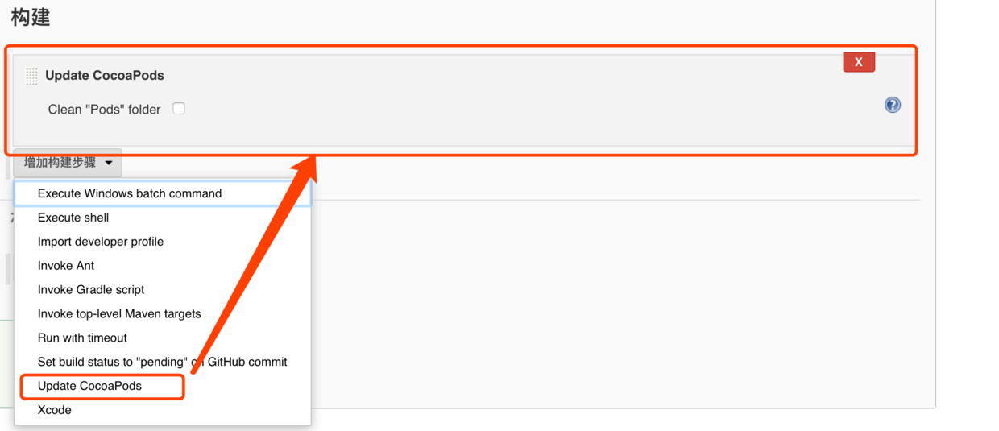


构建中我们选择“增加构建步骤” > “Execute shell”
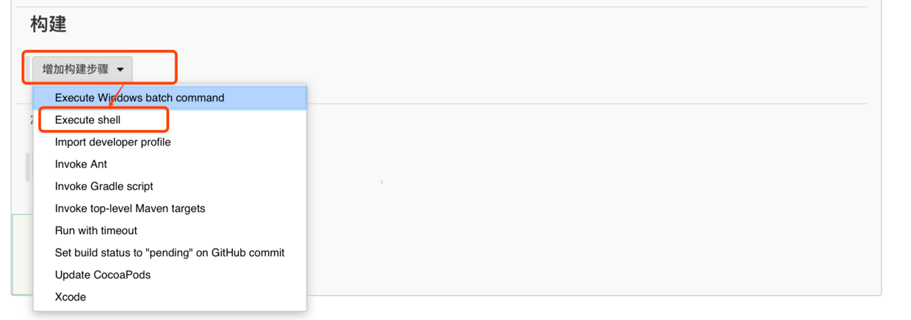

在这里你可以自由发挥，终端的命令都可以用在这里，如果需要哪些东西可以现在终端测试通过了再直接粘过来。

如果没有使用Update CocoaPods这个步骤，那么我们可以通过使用shell来执行pod命令
`pod install --verbose --no-repo-update`

pod完成之后我们来开始我们的打包步骤：
最主要的就是`xcodebuild archive`, `xcodebuild -exportArchive`这两个命令

```shell
# scheme变量, 后边用的地方比较多，使用变量比较方便
SCHEME=testScheme
#获取系统时间，每次打包后放在打包时间的文件夹下，这样比较好区分
DATE=`date '+%Y-%m-%d_%H:%M:%S'`

#一下一段是为了取得版本号，用来重命名ipa包
#将Build号从Info.plist文件中取出来，导出到version这个文件中
plutil -extract CFBundleVersion binary1 $SCHEME/Info.plist -o version
#从version文件中取出刚才导出的Build号，我的Build是1.0.0.0这种格式的，这里读出后的是"1.0.0.0"这个样子的，是带引号的
VERSION=$(plutil -p version)
#处理Build号到需要的格式，去掉.及引号
VERSION_NUM=`echo ${VERSION//./}`
#最终获得1000这种格式
VERSION_NUM=`echo ${VERSION_NUM//\"/}`

# 将工程打包成.xcarchive的文件，这里需要指定一些参数
# -workspace 由于我这里是pod项目，所以需要使用-workspace这个参数，如果不是需要替换为-project这个参数，后边带上参数名
# -scheme 需要打包的scheme的名字，可以使用xcodebuild -list在项目根目录下查看
# ENABLE_BITCODE 是否使用bitcode打包
# CODE_SINE_IDENTITY 这个是证书的identity，后边告诉大家如何查看
# PROVISIONING_PROFILE 打包使用的描述文件UUID，描述文件的名称貌似也可以，不过我没有试验，如果可以请指正，至于描述文件UUID的查看方法后边有写
# -archivePath 导出.xcarchive 文件的路径
# -configuration 打包环境 release或是debug
# -destination 这个copy来的，应该就是平台之类的吧
xcodebuild archive -workspace $SCHEME.xcworkspace \
-scheme $SCHEME \
-sdk "iphoneos" \
ENABLE_BITCODE="NO" \
CODE_SINE_IDENTITY="iPhone Distribution:....." \
PROVISIONING_PROFILE="50c90b02-0545-494b-87ff-4c00e8b4415a" \
-archivePath ./$scheme.xcarchive \
-configuration Debug \
-destination generic/platform=iOS

# 导出xcarchive文件到ipa文件
# -archivePath上一步导出的xcarchive路径
# -exportPath 导出.ipa到哪里
# -exportOptionsPlist 这个xcode9之后是必须的，所以后边写了一下archiveOpt.plist包含的内容，这个可以直接在工程里添加，上传到版本管理工具然后check代码的时候直接down下来，然后从工程项目读取就行了，或者通过plutil自动生成
xcodebuild -exportArchive -archivePath $SCHEME'.xcarchive' \
-exportPath './'$SCHEME'/'$DATE'/' \
-exportOptionsPlist 'exportOptionsPlist.plist'

# 这里其实就是重命名了一下ipa，加了个版本号在名字后边，方便管理
mv './'$SCHEME'/'$DATE'/'$SCHEME'.ipa' './'$scheme'/'$DATE'/'$SCHEME''$VERSION_NUM.ipa
```
最终整个shell看起来是这样的
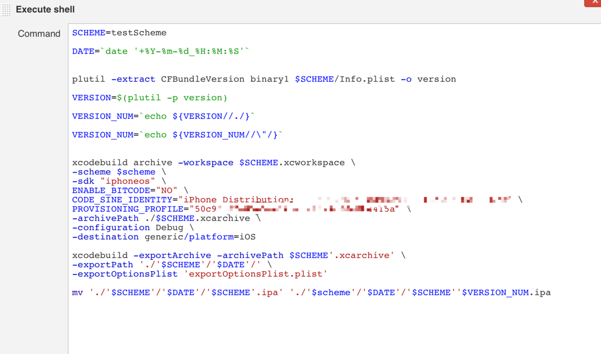


读取证书的identity，直接拷出来就好了

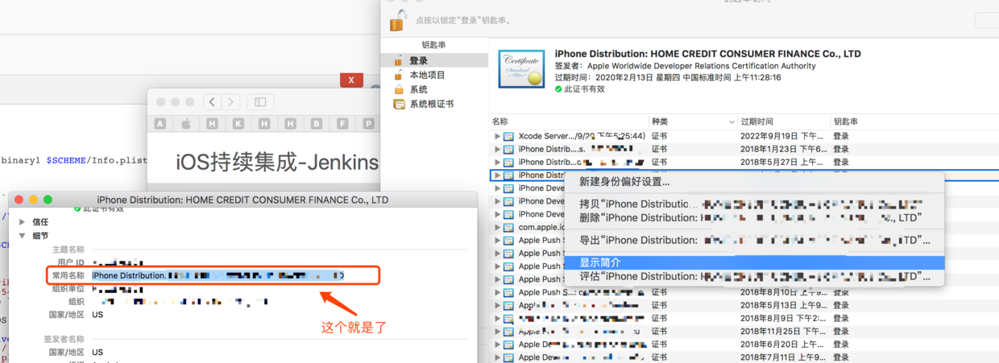

描述文件：
可以通过jenkins插件查看 “Keychains and Provisioning Profiles Management”这个插件
在系统管理中找到这个插件
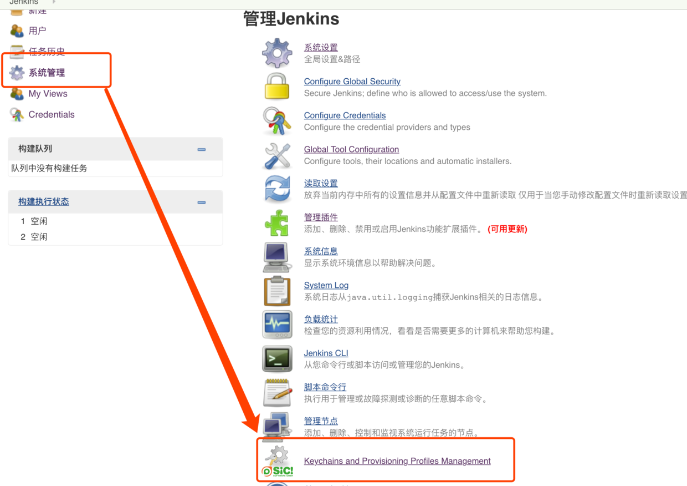

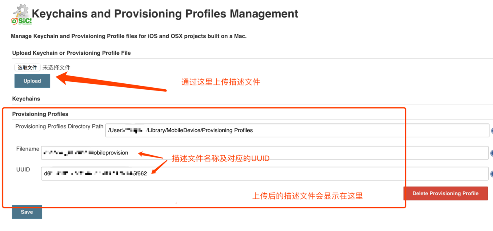


exportOptionsPlist

需要包含的内容
teamID
string类型
证书显示简介中的组织单位

method  
string类型可选值 app-store, ad-hoc, package, enterprise, development, developer-id, mac-application

provisioningProfiles
dict类型
key-要打包app的bundle ID
value-要使用的描述文件的UUID或者名称
可以添加多组值，用于多个项目打包

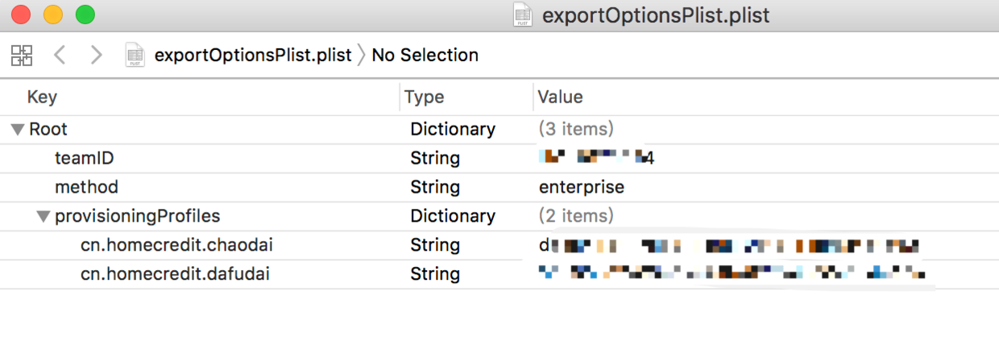


整个配置好之后我们就可以实现自动打包了，需要打包的时候我们可以分环境给项目设置多个target，然后就可以一次性打出好多包来，我们做的只是点一下等着打包结束就好了
当然后边也可以集成蒲公英，fir等测试分发平台，这个好多教程也就不多赘述了。
在不断完善过程中你会发现你的生活这的是越来越方便~~~

我同样试了一下使用循环通过定义scheme数组的方式打包，不过没有成功，不知道为啥打包是成功的但是循环没有执行完，我一次性打包两个scheme最终运行正确却只出来一个，无奈只能copy一份代码来执行，不知道有没有大神了解这是怎么回事

标题有点唬人了，只是提了个自动打包，就美其名曰持续集成了，其实持续集成是一个不断完善的过程，主要还是软件开发到部署整个流程上的控制以及完善，让开发整个流程中的个人只需关注自己真正要做的事情，其他的都交给系统去处理，实现开发测试部署各阶段中间流程的自动化

ok, 就是这样了，哪里有表述不清楚或者有问题的希望大神们指正，毕竟是刚刚开始研究，有很多模糊的地方
