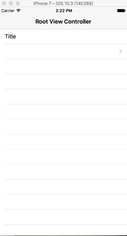

没什么事研究了一下自定义ViewController切换动画，主要就是主ViewController实现`UIViewControllerTransitioningDelegate`协议中的

显示：
```Swift
optional public func animationController(forPresented presented: UIViewController, presenting: UIViewController, source: UIViewController) -> UIViewControllerAnimatedTransitioning?
```

隐藏：
```Swift
func animationController(forDismissed dismissed: UIViewController) -> UIViewControllerAnimatedTransitioning?
```

两个代理方法，在两个代理方法中返回实现了`UIViewControllerAnimatedTransitioning`协议的两个方法的自定义动画对象，闲话少絮，直接上代码，参照官方案例写的代码，做了小小的改动

```Swift

//主ViewController
class ViewController： UITableViewController, UIViewControllerTransitioningDelegate{
    //.....需要在ViweDidload方法中设置navgationCroller的dalegate为主ViewController
    //tableView代理方法，点击cell 使用present方式显示控制器
    override func tableView(_ tableView: UITableView, didSelectRowAt indexPath: IndexPath) {
            let controller =  AniTestViewController() //要显示的VC实例
            //设置代理为主VC
            controller.transitioningDelegate = self 
            self.present(controller, animated: true, completion: nil)
    }
    //显示vc代理方法
    func animationController(forPresented presented: UIViewController, presenting: UIViewController, source: UIViewController) -> UIViewControllerAnimatedTransitioning? {
        let aminator = MyAnimator(presenting: true)
        return aminator
    }
    //隐藏vc代理方法
    func animationController(forDismissed dismissed: UIViewController) -> UIViewControllerAnimatedTransitioning? {
        let animator = MyAnimator(presenting: false)
        return animator
    }
    //navgationController代理方法，如果有navgationController的话
    func navigationController(_ navigationController: UINavigationController, animationControllerFor operation: UINavigationControllerOperation, from fromVC: UIViewController, to toVC: UIViewController) -> UIViewControllerAnimatedTransitioning? {
        if operation == .push {
            let aminator = MyAnimator(presenting: true)
            return aminator
        }else if operation == .pop{
            let aminator = MyAnimator(presenting: false)
            return aminator
        }
        return nil;
    }
}

```

```Swift
//实现UIViewControllerAnimatedTransitioning协议的类，可以是任何类
class MyAnimator: NSObject, UIViewControllerAnimatedTransitioning{
    //在初始化方法中设置初始值，用以判断是显示还是隐藏vc
    var presenting:Bool = true
    
    init(presenting: Bool) {
        super.init()
        self.presenting = presenting
    }
    
    //代理方法，返回动画执行时间
    func transitionDuration(using transitionContext: UIViewControllerContextTransitioning?) -> TimeInterval {
        return 0.5
    }
    
    //动画执行方法，用以写动画执行过程
    func animateTransition(using transitionContext: UIViewControllerContextTransitioning) {
        //通过transitionContext获取用来执行动画的View
        let containerView = transitionContext.containerView
        //要从哪个vc跳转，比如在A_ViewController中要显示B_ViewController， fromVC就是A
        let fromVC = transitionContext.viewController(forKey: .from)
        //要从跳转到哪个VC，比如在A_ViewController中要显示B_ViewController， toVC就是B
        let toVC = transitionContext.viewController(forKey: .to)
        //如果已经在A中执行过present，要dismiss掉B的时候，那么A为toVC，B为fromVC

        //toView与fromView可以按toVC和fromVC的方式理解，也就是即将要显示的那个View叫做toView，现在显示的View叫做fromView
        let toView = transitionContext.view(forKey: .to)
        let fromView = transitionContext.view(forKey: .from)
        
        //获取动画的各个frame
        //containerFrame，动画执行所在的区域，也就是ScreenBounds
        let containerFrame = containerView.frame
        //要显示的VC开始所在的位置大小，默认（x:0, y:0, width:0, Height:0）
        var toViewStartFrame = transitionContext.initialFrame(for: toVC!)
        //要显示的VC最终要移动到的位置大小，默认（x:0, y:0, width:ScreenWidth, Height:ScreenHeight）
        let toViewFinalFrame = transitionContext.finalFrame(for: toVC!)
        //现在显示的VC最终的位置大小，默认（x:0, y:0, width:0, Height:0）
        var fromViewFinalFrame = transitionContext.finalFrame(for: fromVC!)
        
        containerView.addSubview(toView!)
        //判断是显示还是隐藏
        if self.presenting{
            //显示
            //设置 toViewStartFrame用以初始化要显示VC的初始位置
            toViewStartFrame.origin.x = containerFrame.size.width
            toViewStartFrame.origin.y = containerFrame.size.height
            toView?.frame = toViewStartFrame
        }else{
            //如果是隐藏
            //设置现在显示的VC动画结束的位置
            fromViewFinalFrame = CGRect.init(x: containerFrame.size.width, y: containerFrame.size.height, width:(toView?.frame.size.width)!, height:(toView?.frame.size.height)!);
            //设置要显示View的frame为当前显示的View的位置，并将其移动到但钱view的下面
            toView?.frame = toViewFinalFrame
            containerView.bringSubview(toFront: fromView!)
        }
        
        //执行动画
        UIView.animate(withDuration: self.transitionDuration(using:transitionContext), animations: {
            if self.presenting{
                //如果是显示的话那么就设置要显示的View的动画结束位置，UIView会自动执行动画
                toView?.frame = toViewFinalFrame
            }else{
                //移除的时候设置现在显示的View的动画结束位置
                fromView?.frame = fromViewFinalFrame
            }
            //当然，如果你愿意的话可以自己设置各种各样的动画效果，以满足需求
        }) { (finshed) in
            //动画结束如果失败的话则需要将要显示的view移除掉
            let success = !transitionContext.transitionWasCancelled
            if self.presenting && !success || !self.presenting && success{
                toView?.removeFromSuperview()
            }
            //告诉UIKit动画执行结束了，以执行之后的操作
            transitionContext.completeTransition(success)
        }
    }
    
    
}
```

动画效果就是这个样子的：：：





示例代码：https://github.com/HiGodl/ViewControllerChangeAnim
